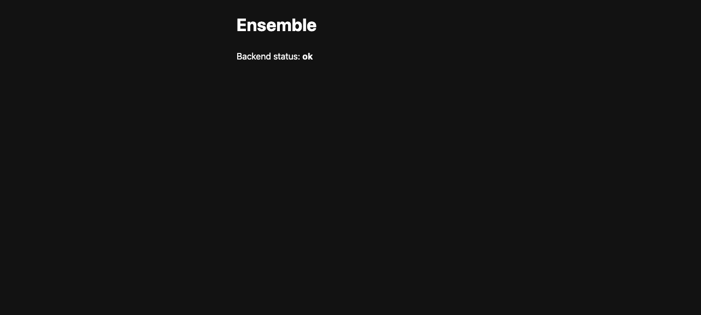

# Task 04 Proofs — Multi-stage Docker image

## Task Summary

This task proves the app ships as one runnable image. A multi-stage Dockerfile
builds the frontend (Node stage), packages the Spring Boot jar with those assets
embedded (JDK stage), and runs the jar on a slim JRE (runtime stage). The
resulting container serves both the API and the UI on a single port.

## What This Task Proves

- `docker build` succeeds and produces a single image (`ensemble:skeleton`).
- The image uses three stages: `node:20-alpine` → `eclipse-temurin:21-jdk` → `eclipse-temurin:21-jre`.
- `docker run` + `curl localhost:8080/api/health` returns `200` `{"status":"ok"}` (Unit 3 container FR).
- The container serves the UI at `/` (`<title>Ensemble</title>`), and a browser renders **"Backend status: ok"**.
- No manual copy step: the frontend is built inside the image and its assets are embedded in the jar.

## Evidence Summary

- `docker build -t ensemble:skeleton .` completes (30 build steps DONE); final image ~512 MB.
- Build log shows the three expected base images across the `frontend`, `backend`, and `runtime` stages.
- The running container answers `GET /api/health` → 200 `{"status":"ok"}` and `GET /` → 200 with the SPA HTML.
- Screenshot of `http://localhost:8080/` served from the container shows the rendered status.

## Artifact: Multi-stage build succeeds

**What it proves:** The Dockerfile builds end-to-end into one image using the three intended stages.

**Why it matters:** Single-image packaging is the whole point of this unit — it's what the later AWS App Runner deploy ships.

**Command:**

```bash
docker build -t ensemble:skeleton .
docker images ensemble:skeleton --format "{{.Repository}}:{{.Tag}}  {{.Size}}"
```

**Result summary:** Build succeeds; the three stages pull `node:20-alpine`, `eclipse-temurin:21-jdk`, and `eclipse-temurin:21-jre`; final image is ~512 MB.

```
#12 [frontend 1/6] FROM docker.io/library/node:20-alpine
#9  [backend  1/9] FROM docker.io/library/eclipse-temurin:21-jdk
#10 [runtime  1/3] FROM docker.io/library/eclipse-temurin:21-jre
#15 [frontend 4/6] RUN npm ci
...
#27 naming to docker.io/library/ensemble:skeleton done

ensemble:skeleton  512MB
```

## Artifact: Container serves the API + UI

**What it proves:** The running container serves the JSON API and the UI on port 8080.

**Why it matters:** This is the deployable runtime shape — one container, one port, both surfaces.

**Command:**

```bash
docker run -d --name ensemble-skeleton -p 8080:8080 ensemble:skeleton
curl -s localhost:8080/api/health          # API
curl -s -o /dev/null -w "%{http_code}" localhost:8080/   # UI root
curl -s localhost:8080/ | grep -o '<title>Ensemble</title>'
```

**Result summary:** API returns `{"status":"ok"}`, the root returns 200 with the SPA HTML.

```
/api/health -> HTTP 200  {"status":"ok"}
/           -> HTTP 200  (<title>Ensemble</title>)
container: ensemble:skeleton  Up  0.0.0.0:8080->8080/tcp
```

## Artifact: UI rendered from the container

**What it proves:** A browser pointed at the container renders the health status fetched from the same-origin API.

**Why it matters:** This is the Unit 3 container proof — the image serves the real UI, not just the API.

**Artifact path:** `docs/specs/01-spec-app-skeleton/01-proofs/artifacts/04-task-docker-container-8080.png`

**Result summary:** The page shows `Ensemble` and **"Backend status: ok"**, served from the container.



## Reviewer Conclusion

A single multi-stage image builds the UI, embeds it in the Spring Boot jar, and
runs on a slim JRE — serving both `/api/health` and the UI on port 8080. This is
the one-container deployable the architecture targets.
