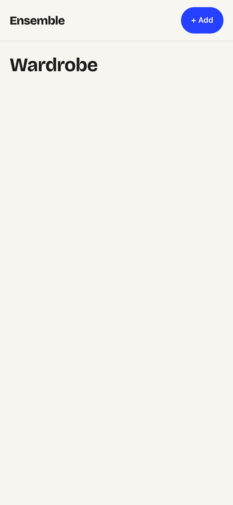

# Task 01 Proofs — App shell: routing, typed API client & branded design foundation

## Task Summary

This task builds the frontend foundation every wardrobe screen sits on: client-side
routing (React Router v7), a typed `/api/items` client that mirrors the backend
DTOs, and a distinctive "Care Label" mobile-first design system. It persists no
behavior of its own — it is the skeleton Tasks 2–4 build screens onto.

## What This Task Proves

- The `/api/items` client issues the correct request shape (multipart for
  tag-preview/create, JSON for update-tags) and maps 2xx / non-2xx / network
  outcomes — with the network mocked, no live backend.
- The three routes (`/`, `/add`, `/item/:id`) each mount their screen, and the
  shell exposes a persistent "add" control.
- The app lints clean and builds, emitting assets into Spring's static resources
  (one process serves API + UI).
- The branded mobile-first shell renders as designed at a phone viewport.

## Evidence Summary

- `items.test.ts` — 15 tests green (API client contract).
- `App.test.tsx` — 4 tests green (routing + persistent nav).
- `npm run lint` clean; `npm run build` succeeds → `src/main/resources/static/`.
- Mobile screenshot shows the "Ensemble" wordmark (Bricolage Grotesque), the
  cobalt "+ Add" pill, and the warm paper canvas.

## Artifact: API client contract tests

**What it proves:** Each client function builds the right method/path/body and
maps success, non-2xx, and network-failure cases.

**Why it matters:** All three screens depend on this layer; the multipart-vs-JSON
split must match the backend or every save round-trips a 400.

**Command:** `cd frontend && npm run test -- --run src/api/items.test.ts`

**Result summary:** 15 tests pass — list/get/photoUrl/tagPreview/create/updateTags/delete.

```
✓ src/api/items.test.ts (15 tests)
 Test Files  1 passed (1)
      Tests  15 passed (15)
```

## Artifact: Routing + shell tests

**What it proves:** `/`, `/add`, `/item/:id` mount the grid / add / detail screens,
and a persistent link to `/add` is always present.

**Why it matters:** Routing is the navigation backbone; the persistent add control
is spec Unit 1 FR5.

**Command:** `cd frontend && npm run test -- --run src/App.test.tsx`

**Result summary:** 4 tests pass (one per route + the persistent add link).

```
✓ src/App.test.tsx (4 tests)
 Test Files  1 passed (1)
      Tests  4 passed (4)
```

## Artifact: Lint + build

**What it proves:** The shell type-checks, lints clean, and builds into Spring's
static output directory.

**Why it matters:** The single-container deploy model requires the Vite build to
land in `src/main/resources/static/`.

**Commands:** `cd frontend && npm run lint` and `npm run build`

**Result summary:** ESLint reports no errors; Vite builds and writes `index.html`
+ hashed CSS/JS assets to `../src/main/resources/static/`.

```
> eslint .
(no output — clean)

vite v6.4.3 building for production...
✓ 44 modules transformed.
../src/main/resources/static/index.html                 0.81 kB
../src/main/resources/static/assets/index-*.css         2.66 kB
../src/main/resources/static/assets/index-*.js        232.69 kB
✓ built in 562ms
```

## Artifact: Branded mobile shell screenshot

**What it proves:** The "Care Label" design foundation renders — warm paper canvas
(`#F7F5F0`), the Bricolage Grotesque "Ensemble" wordmark, and the single cobalt
accent on the "+ Add" pill, with a hairline-separated sticky header.

**Why it matters:** Spec Unit 1 FRs 4–5 require an intentional mobile-first style
and a persistent add affordance — not browser defaults.

**Artifact path:** `04-task-01-app-shell.png` (viewport: iPhone 14, 390px CSS width)



## Reviewer Conclusion

The foundation is complete and verified: the typed API layer, client-side routing,
and a distinctive branded mobile shell are all in place and green, ready for the
grid, add, and detail screens to build on.
