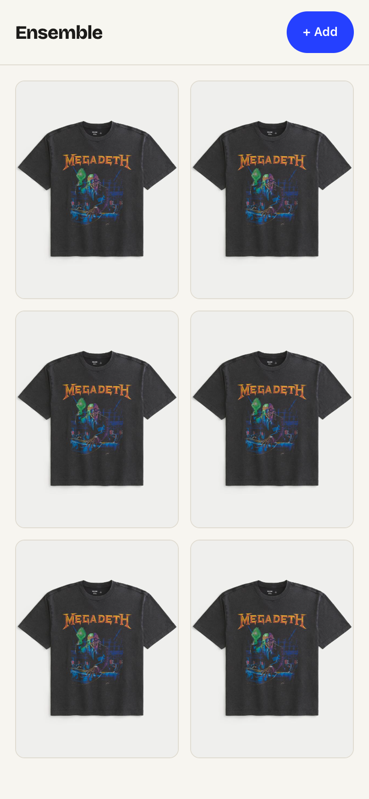
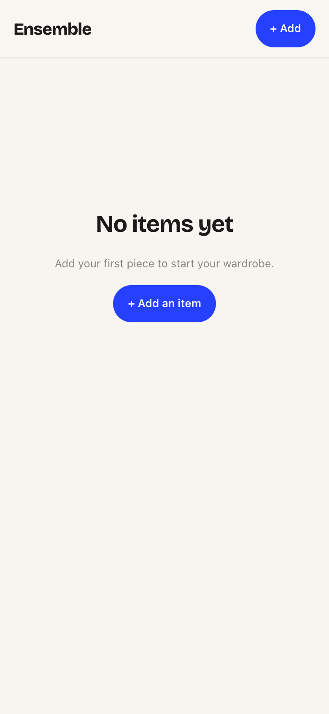

# Task 02 Proofs — Wardrobe grid (browse owned items)

## Task Summary

This task proves the home screen (`/`) renders the wardrobe as a mobile-first
photo grid: it fetches the item list on load, renders each item as a lazy-loaded
thumbnail that links to its detail route, and handles the empty and list-failure
edge states without crashing (spec Unit 2, FRs 1–5).

## What This Task Proves

- N owned items render as N thumbnails, each sourced from the item's `photoUrl`
  and marked `loading="lazy"` (bytes fetched per-item, never embedded in list JSON).
- Tapping a thumbnail navigates to that item's `/item/:id` detail route.
- An empty wardrobe shows a clear empty state that links to `/add`.
- A failed list request shows a non-crashing error state whose **Try again**
  control re-fetches and recovers the grid.

## Evidence Summary

- `WardrobeGrid.test.tsx` (4 tests) passes — covers populated grid, tap→navigate,
  empty state, and error→retry→recovery.
- ESLint is clean (exit 0), including the `react-hooks` effect rules.
- Mobile screenshots at 390px show the branded populated grid and the empty state.

## Artifact: Grid component tests

**What it proves:** The grid's rendering decisions and all three edge states work
against a mocked API, with no live network.

**Why it matters:** These are the meaningful front-end behaviors (browse, navigate,
empty, error/retry) that the spec's acceptance depends on.

**Command:**

```bash
cd frontend && npm run test -- --run src/routes/WardrobeGrid.test.tsx
```

**Result summary:** All 4 tests pass.

```
 ✓ src/routes/WardrobeGrid.test.tsx (4 tests) 96ms
 Test Files  1 passed (1)
      Tests  4 passed (4)
```

## Artifact: Lint clean

**What it proves:** The grid satisfies the repo's ESLint config, including the
`react-hooks/set-state-in-effect` rule (fetch settles via promise callbacks, not a
synchronous setState in the effect body).

**Why it matters:** Lint is a pre-commit gate; a clean run keeps commits unblocked.

**Command:**

```bash
cd frontend && npm run lint
```

**Result summary:** ESLint exits 0 with no problems.

## Artifact: Populated grid at mobile width

**What it proves:** The grid renders real garment thumbnails in a branded,
mobile-first two-column layout with the persistent add affordance.

**Why it matters:** This is the browse surface a demo viewer sees first; it must
read as an intentional product, not a raw list.

**Artifact path:** `docs/specs/04-spec-wardrobe-ui/04-proofs/04-task-02-wardrobe-grid.png`

**Result summary:** Six lazy-loaded thumbnails render in a 2-up grid at 390px under
the sticky "Ensemble / + Add" header. (Screenshot uses a mocked API; the same
garment photo is served for every cell.)



## Artifact: Empty-wardrobe state

**What it proves:** A first-time user with no items sees a clear prompt to add
their first piece rather than a blank screen.

**Why it matters:** Empty state is an explicit spec edge case (FR4) and a key
first-run UX moment.

**Artifact path:** `docs/specs/04-spec-wardrobe-ui/04-proofs/04-task-02-empty-state.png`

**Result summary:** The empty state shows a "No items yet" heading, a helper line,
and a primary "+ Add an item" button linking to `/add`.



## Reviewer Conclusion

The grid screen is complete and demoable: it browses owned items as lazy-loaded
thumbnails, navigates to detail on tap, and degrades gracefully to clear empty and
retryable-error states — all covered by passing tests and a clean lint run.
