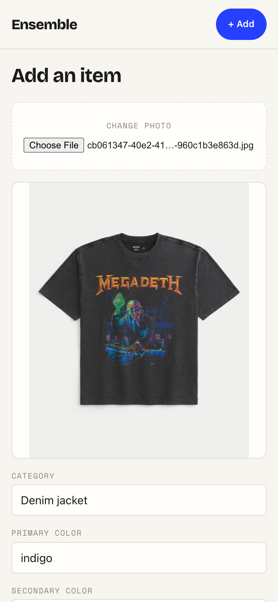
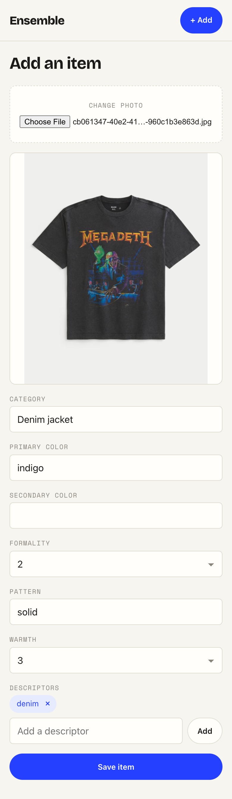

# Task 03 Proofs — Add item (photo → auto-tag → edit → save)

## Task Summary

This task proves the headline flow (spec Unit 3): selecting a garment photo
auto-fires tag-preview, pre-fills an editable tag form (with add/remove
descriptor chips), gates save behind the same required-field rules the backend
enforces, creates the item on save, and returns to the grid — while a degraded
suggestion stays editable and a create failure preserves the user's work.

## What This Task Proves

- **Auto-tag on select:** choosing a photo fires `tagPreview(file)` with no
  separate button and pre-fills the form from the suggestion.
- **Degraded vision is editable, not an error:** an all-null suggestion renders
  empty, editable fields and still produces a valid save.
- **Client guardrail:** save is disabled until `category` is non-blank and
  `formality` (1–5) / `warmth` (1–3) are valid — mirroring backend `TagRequest`.
- **Create + navigate:** a successful save calls `createItem(photo, tags)` with
  the right payload, then routes to the wardrobe grid.
- **No data loss:** a create failure surfaces an error while keeping the photo
  preview and the entered tags intact.

## Evidence Summary

- 27 tests pass across the validator, the two shared components, and the screen:
  `tagValidation` (14, all branches), `DescriptorChips` (4), `TagForm` (5),
  `AddItem` (4).
- ESLint clean; `npm run build` succeeds.
- A mobile screenshot shows the full add flow: photo preview + auto-tag form +
  chips + enabled save.

## Artifact: tagValidation — critical guardrail (100% branch)

**What it proves:** Every required-field branch is exercised — blank/whitespace
category, formality null/<1/>5 and boundaries, warmth null/<1/>3 and boundaries.

**Why it matters:** This is the client mirror of the backend validation; it must
match exactly to avoid a round-trip 400 and to gate save correctly.

**Command:**

```bash
cd frontend && npm run test -- --run src/lib/tagValidation.test.ts
```

**Result summary:** 14 tests pass covering all validity branches.

```
 ✓ src/lib/tagValidation.test.ts (14 tests)
```

## Artifact: Shared components + add screen tests

**What it proves:** The descriptor chip editor, the reusable tag form, and the add
screen behave correctly against a mocked API with no live network.

**Why it matters:** These cover the headline flow's meaningful logic (auto-tag,
degraded fallback, validation gate, create+navigate, failure preservation).

**Command:**

```bash
cd frontend && npm run test -- --run \
  src/components/DescriptorChips.test.tsx \
  src/components/TagForm.test.tsx \
  src/routes/AddItem.test.tsx
```

**Result summary:** 13 tests pass (4 + 5 + 4).

```
 ✓ src/components/DescriptorChips.test.tsx (4 tests)
 ✓ src/components/TagForm.test.tsx (5 tests)
 ✓ src/routes/AddItem.test.tsx (4 tests)
```

## Artifact: Add flow at mobile width

**What it proves:** After selecting a photo, the screen shows a preview and an
editable, pre-filled tag form; the AI suggestion (`Denim jacket` / `indigo` /
formality 2 / `solid` / warmth 3 / `denim` chip) is fully correctable.

**Why it matters:** This is spec acceptance criterion 1 — the demo's headline
moment — captured at a phone viewport.

**Artifact path:** `docs/specs/04-spec-wardrobe-ui/04-proofs/04-task-03-add-flow.png`

**Result summary:** The photo picker, garment preview, and auto-populated
care-label form render at 390px.



**Full form (scrolled):** the complete field set, the `denim ×` removable chip,
the add-a-descriptor input, and the enabled **Save item** button.

**Artifact path:** `docs/specs/04-spec-wardrobe-ui/04-proofs/04-task-03-add-form-full.png`



## Reviewer Conclusion

The headline add flow works end-to-end against a mocked API and reads as an
intentional mobile product: photo → automatic tags → editable form with chips →
validated save → back to the grid, with graceful degraded-suggestion and
create-failure handling.
