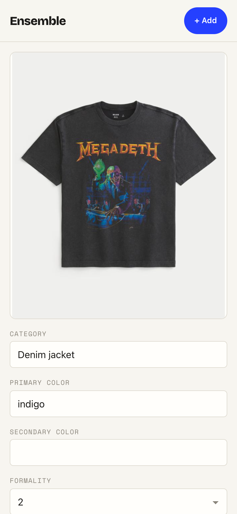
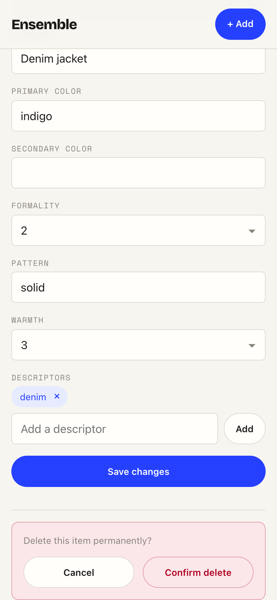

# Task 04 Proofs — Item detail (edit tags + guarded delete)

## Task Summary

This task proves the maintenance screen (spec Unit 4): `/item/:id` loads a single
item, shows its photo and an editable `TagForm` (reused from the add flow), saves
tag edits via `updateTags`, and deletes the item behind an explicit two-step
confirmation. Wear-history is intentionally not shown (deferred to #7), and load /
save / delete failures degrade without crashing or losing context.

## What This Task Proves

- **Load + edit + save:** the screen fetches the item, edits a field, and calls
  `updateTags(id, tags)` with a JSON payload obeying the same required-field rules
  as create.
- **No wear-history:** `lastWorn` / `wornCount` are never rendered (issue #7 scope).
- **Guarded delete:** the first press only arms confirmation; `deleteItem` is
  called only after an explicit **Confirm delete**, then the app returns to the grid.
- **Non-crashing edges:** an unloadable id shows a "not found" state with a link
  back to the grid; a failed save or delete shows an error and keeps the user's
  context (edited values / current page) intact.

## Evidence Summary

- `ItemDetail.test.tsx` (6 tests) passes — edit→updateTags, no-wear-history,
  confirm→delete→navigate, not-found, save-failure, delete-failure.
- Full suite green (56 tests), ESLint clean, `npm run build` succeeds.
- Mobile screenshots show the editable detail surface and the guarded delete.

## Artifact: Item detail tests

**What it proves:** All maintenance behaviors and edge states work against a
mocked API with no live network.

**Why it matters:** These are acceptance criteria 2–3 (edit + delete) plus the
required non-crashing error handling.

**Command:**

```bash
cd frontend && npm run test -- --run src/routes/ItemDetail.test.tsx
```

**Result summary:** 6 tests pass.

```
 ✓ src/routes/ItemDetail.test.tsx (6 tests)
```

## Artifact: Full suite + lint

**What it proves:** Adding the detail screen keeps the whole front-end suite green
and lint-clean (the shared `TagForm` is reused, not duplicated).

**Command:**

```bash
cd frontend && npm run test -- --run && npm run lint
```

**Result summary:** 56 tests pass across 8 files; ESLint exits 0.

## Artifact: Item detail at mobile width

**What it proves:** The screen renders the item photo above an editable tag form,
with **no** wear-history fields present.

**Why it matters:** This is the maintenance surface (edit) and demonstrates the
#7 deferral (no `lastWorn`/`wornCount`).

**Artifact path:** `docs/specs/04-spec-wardrobe-ui/04-proofs/04-task-04-item-detail.png`

**Result summary:** Photo + editable Category/Primary color/… fields at 390px; no
wear-history is shown.



## Artifact: Guarded delete confirmation

**What it proves:** Deleting requires an explicit second step — a distinct
"Delete this item permanently?" block with **Cancel** and **Confirm delete** —
rather than a single-tap destructive action.

**Why it matters:** FR4 requires a confirmation to avoid accidental removal.

**Artifact path:** `docs/specs/04-spec-wardrobe-ui/04-proofs/04-task-04-delete-confirm.png`

**Result summary:** After pressing "Delete item", a danger-styled confirmation
appears with Cancel and Confirm delete; only the confirm issues `deleteItem`.



## Reviewer Conclusion

The detail screen completes wardrobe maintenance: view, edit-and-save, and a
guarded delete — all covered by passing tests, with graceful not-found and
failure states and no out-of-scope wear-history UI.
