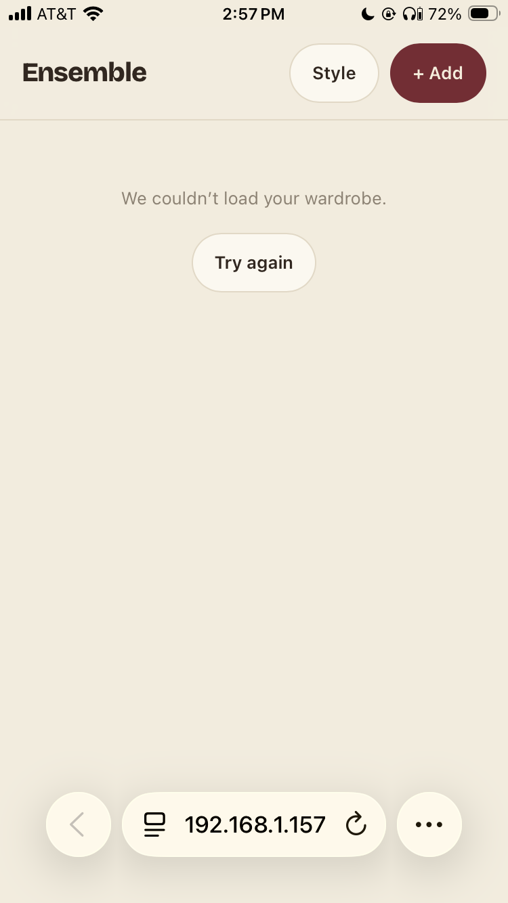
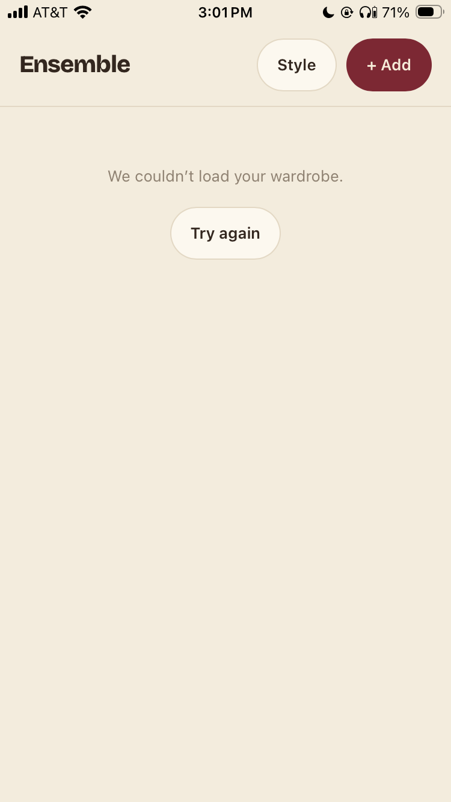

# Task 01 Proofs - PWA install (manifest, service worker, icons & iOS meta)

## Task Summary

This task makes the built Ensemble app installable to an iPhone home screen and launchable
standalone (no browser chrome), via `vite-plugin-pwa`. It adds a web app manifest, a
generated service worker that never caches `/api/**`, a maroon-on-beige icon set (192/512/
maskable + apple-touch), and the iOS meta tags Safari needs for "Add to Home Screen".

## What This Task Proves

- `npm run build` emits a valid manifest + service worker + icon set into
  `src/main/resources/static/`, so Spring serves them at `/` with no separate hosting step.
- The manifest satisfies the spec's minimum fields (name/short_name/start_url/standalone
  display/background+theme color/192+512+maskable icons).
- `index.html` carries the iOS standalone meta tags and apple-touch-icon link.
- The service worker's navigation route excludes `/api`, so authed/priced API responses are
  never served from the precache.
- The app was installed to a real iPhone home screen and opens fully standalone.

## Evidence Summary

- Build output lists `manifest.webmanifest`, `sw.js`, `workbox-*.js`, and all 5 icon files in
  `src/main/resources/static/`.
- The manifest JSON has all required fields, including a `maskable` icon entry.
- The compiled `sw.js` registers a `NavigationRoute` with `denylist:[/^\/api/]`.
- Generated `index.html` contains the iOS meta tags and the apple-touch-icon link.
- Two iPhone screenshots: Safari browsing the LAN preview (address bar visible), and the
  installed home-screen icon opened standalone (no Safari chrome at all).
- Frontend test suite (72 tests) and lint stay green after the SW-registration/main.tsx change.

## Artifact: Production build output

**What it proves:** `vite-plugin-pwa` is wired into the build and emits the PWA artifacts into
the same static output Spring serves.

**Why it matters:** This is the mechanical proof the plugin is active and targeting the right
output directory — nothing downstream works without it.

**Command:**

~~~bash
cd frontend && npm run build
~~~

**Result summary:** Build succeeded; PWA plugin reported `generateSW` mode with 10 precached
entries, and wrote `sw.js` + `workbox-9c191d2f.js` alongside the existing JS/CSS bundle.

~~~text
> ensemble-frontend@0.0.1 build
> tsc -b && vite build

vite v6.4.3 building for production...
transforming...
✓ 54 modules transformed.
../src/main/resources/static/manifest.webmanifest                          0.39 kB
../src/main/resources/static/index.html                                    1.13 kB │ gzip:  0.52 kB
../src/main/resources/static/assets/index-D8bdy2uc.css                     7.89 kB │ gzip:  2.14 kB
../src/main/resources/static/assets/workbox-window.prod.es5-BBnX5xw4.js    5.75 kB │ gzip:  2.36 kB
../src/main/resources/static/assets/index-N-J5F5Mh.js                    248.03 kB │ gzip: 78.33 kB
✓ built in 435ms

PWA v1.3.0
mode      generateSW
precache  10 entries (256.64 KiB)
files generated
  ../src/main/resources/static/sw.js
  ../src/main/resources/static/workbox-9c191d2f.js
~~~

**Artifact path:** `src/main/resources/static/`

~~~text
apple-touch-icon.png
assets/
favicon.ico
index.html
manifest.webmanifest
maskable-icon-512x512.png
pwa-192x192.png
pwa-512x512.png
sw.js
workbox-9c191d2f.js
~~~

## Artifact: Manifest content

**What it proves:** The manifest declares all spec-required minimum fields.

**Why it matters:** A missing field (e.g. no maskable icon, wrong `display`) silently breaks
the install prompt on some platforms.

**Command:**

~~~bash
cat src/main/resources/static/manifest.webmanifest | python3 -m json.tool
~~~

**Result summary:** `name`/`short_name` = "Ensemble", `start_url` = "/", `display` =
"standalone", `background_color`/`theme_color` = "#f3ecdd" (matching the existing
`<meta name="theme-color">`), and an `icons` array with 192, 512, and a `maskable`-purpose
512 entry.

~~~json
{
    "name": "Ensemble",
    "short_name": "Ensemble",
    "start_url": "/",
    "display": "standalone",
    "background_color": "#f3ecdd",
    "theme_color": "#f3ecdd",
    "lang": "en",
    "scope": "/",
    "icons": [
        { "src": "pwa-192x192.png", "sizes": "192x192", "type": "image/png" },
        { "src": "pwa-512x512.png", "sizes": "512x512", "type": "image/png" },
        { "src": "maskable-icon-512x512.png", "sizes": "512x512", "type": "image/png", "purpose": "maskable" }
    ]
}
~~~

## Artifact: iOS meta tags in the generated shell

**What it proves:** Safari's "Add to Home Screen" gets the standalone/status-bar/title hints
and the apple-touch icon.

**Why it matters:** Without these, iOS treats the install as a plain bookmark that reopens
inside Safari instead of standalone.

**Command:**

~~~bash
grep -A2 "apple-touch-icon\|apple-mobile-web-app" src/main/resources/static/index.html
~~~

**Result summary:** All three `apple-mobile-web-app-*` meta tags and the `apple-touch-icon`
link are present in the built `index.html`.

~~~html
<meta name="apple-mobile-web-app-capable" content="yes" />
<meta name="apple-mobile-web-app-status-bar-style" content="default" />
<meta name="apple-mobile-web-app-title" content="Ensemble" />
<link rel="apple-touch-icon" href="/apple-touch-icon.png" />
~~~

## Artifact: Service worker never caches `/api`

**What it proves:** The generated service worker's navigation fallback route explicitly
excludes `/api/**`, so authed/priced API responses are never served from cache.

**Why it matters:** This is a direct safety requirement — a stale cached response for
`/api/items` or `/api/style` would be a functional and security problem (stale wardrobe data,
or a cached response bypassing the passcode gate built in Task 2.0).

**Command:**

~~~bash
cat src/main/resources/static/sw.js
~~~

**Result summary:** The compiled service worker registers `new e.NavigationRoute(...,
{denylist:[/^\/api/]})` — matching the `navigateFallbackDenylist: [/^\/api/]` config in
`vite.config.ts`.

~~~text
...e.registerRoute(new e.NavigationRoute(e.createHandlerBoundToURL("index.html"),{denylist:[/^\/api/]}))
~~~

## Artifact: No regressions from the SW-registration wiring

**What it proves:** Registering the service worker (`ServiceWorkerRegistration.tsx` mounted
in `main.tsx`) and the new `vite-plugin-pwa/react` type reference didn't break the existing
frontend suite or introduce lint issues.

**Why it matters:** `main.tsx` and `vite-env.d.ts` are shared entry points; a regression here
would affect every route in the app.

**Command:**

~~~bash
cd frontend && npm test -- --run && npm run lint
~~~

**Result summary:** All 10 test files / 72 tests pass; lint reports 0 problems (the initial
react-refresh warning was resolved by extracting `ServiceWorkerRegistration` into its own
file).

~~~text
Test Files  10 passed (10)
     Tests  72 passed (72)
~~~

## Artifact: Real iPhone install — standalone launch

**What it proves:** The end-to-end acceptance criterion: the built app installs to an iPhone
home screen and opens full-screen with no Safari chrome.

**Why it matters:** This is the only proof that actually exercises the feature the way the
app owner will use it in the demo — everything else is necessary but not sufficient.

**Artifact path:** `docs/specs/07-spec-pwa-security-guards/07-proofs/07-task-01-safari-before-install.png`

**Result summary:** The app open in Safari at the LAN preview URL, before installing — the
address bar and toolbar are visible. Shown for contrast with the installed state below (and
because the wardrobe fetch fails here, expected, since only the static preview server is
running, not the Spring backend).

**Artifact path:** `docs/specs/07-spec-pwa-security-guards/07-proofs/07-task-01-standalone-home-screen.png`

**Result summary:** The same app opened from the home-screen icon — no address bar, no
Safari toolbar, top or bottom. This confirms standalone launch.

## Reviewer Conclusion

The build reliably emits a spec-compliant manifest, service worker, and icon set into Spring's
static resources; the service worker never caches `/api`; the iOS meta tags are present in the
shipped HTML; and a real iPhone install confirms the app launches standalone with no browser
chrome. The existing frontend suite and lint remain green, so this slice ships with no known
regressions.
