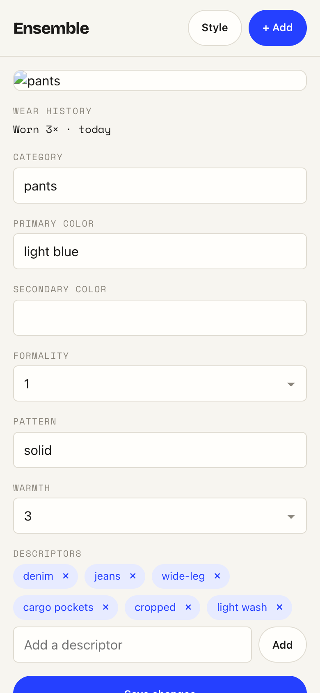
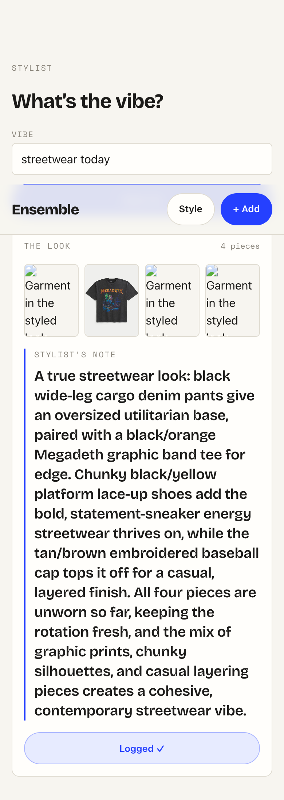

# Task 03 Proofs — Wear-history display + "I wore this look"

## Task Summary

This task surfaces wear-history on the frontend and wires the whole-look wear write.
Item detail now shows a quiet `wornCount` + relative `lastWorn` line (with never-worn /
not-yet-worn fallbacks, display only) via a new `relativeTime` helper; the API client gains
`markWorn(id)` (re-exported from the stylist module); and the outfit card gets an
**"I wore this look"** button that marks every rendered piece worn and **locks to
"Logged ✓"** (one log per look, a failed write → a soft retryable message without losing the
look). Frontend meaningful-logic tests only.

## What This Task Proves

- `relativeTime` maps an instant to a short label ("today", "2 days ago", "2 weeks ago",
  "1 month ago") and an absent instant to "not yet worn".
- `markWorn(id)` POSTs `/api/items/:id/worn` and returns the updated item; a non-2xx throws.
- Item detail renders **"Worn N× · <relative>"**, a **"Never worn"** state (count 0/null),
  and a **"not yet worn"** last-worn state (absent `lastWorn`).
- "I wore this look" calls `markWorn` **once per rendered piece** and **locks to "Logged ✓"**.
- A partial wear-write failure shows a **retryable soft message** and keeps the look on screen.

## Evidence Summary

- The full frontend suite passes — **84 tests / 11 files**, `npm run lint` clean.
- New/updated specs: `relativeTime.test.ts` (6), `items.test.ts` `markWorn` (2),
  `ItemDetail.test.tsx` wear-history display (3, replacing the old "deferred to #7" test),
  `Stylist.test.tsx` wore-this + failure (2).
- Live screenshots (390px viewport, single-process build on 8081) show the item-detail wear
  line and the outfit card locked to "Logged ✓".

## Artifact: Frontend unit + component tests

**What it proves:** the relative-label helper, the `markWorn` client contract, the item
detail display + fallbacks, and the whole-look log/lock + failure handling.

**Why it matters:** this is the meaningful UI logic for the wear side — the display rules
and the one-log-per-look lock must be exact.

**Command:**

~~~bash
cd frontend && npm test -- --run
~~~

**Result summary:** all 11 files / 84 tests pass, including
`relativeTime` (today / days / weeks / months / not-yet-worn),
`items API client › markWorn` (POST + throw),
`ItemDetail › shows the wear count and a relative last-worn label` /
`shows a "Never worn" state` / `shows a "not yet worn" last-worn state`, and
`Stylist route › logs a worn look…locks to "Logged ✓"` /
`keeps the look and shows a retryable message when a wear write fails`.

~~~text
Test Files  11 passed (11)
     Tests  84 passed (84)
~~~

## Artifact: Lint

**What it proves:** the new code meets the repo's eslint flat-config rules.

**Command:**

~~~bash
cd frontend && npm run lint
~~~

**Result summary:** eslint exits clean (no output, status 0).

## Artifact: Item-detail wear-history line (screenshot)

**What it proves:** the deferred wear-history is now shown — a quiet care-label line
reading **"Worn 3× · today"** under the photo.

**Why it matters:** confirms the display renders in the real app, not just under RTL. The
`lastWorn`/`wornCount` shown come from three live `POST /worn` calls against a fresh
single-process build (served on 8081, sharing the dev DynamoDB Local); this incremented the
demo item's wear count as the feature intends.

**Artifact path:** `docs/specs/07-spec-repick-wear-history/07-proofs/assets/item-detail-wear.png`

**Result summary:** the "WEAR HISTORY" eyebrow + "Worn 3× · today" value render above the
editable tag form at a ~390px mobile width.

## Artifact: Outfit card locked to "Logged ✓" (screenshot)

**What it proves:** clicking "I wore this look" marks the look worn and locks the control to
the one-shot **"Logged ✓"** state.

**Why it matters:** confirms the whole-look write + lock behaves end-to-end in the real app
(the click fired `markWorn` for all four rendered pieces, then the button flipped to the
disabled "Logged ✓" confirmation).

**Artifact path:** `docs/specs/07-spec-repick-wear-history/07-proofs/assets/stylist-logged-card.png`

**Result summary:** the outfit card shows the look (4 pieces), the stylist's note, and the
"Logged ✓" locked button. Some garment thumbnails show a placeholder glyph where a local
photo file was absent — orthogonal to this task's logic.

## Reviewer Conclusion

Wear-history is now visible and loggable: the relative-label helper, the `markWorn` client,
the item-detail display with its fallbacks, and the "I wore this look" → "Logged ✓" lock are
all covered by passing tests and confirmed on screen. No secrets appear in this proof.
